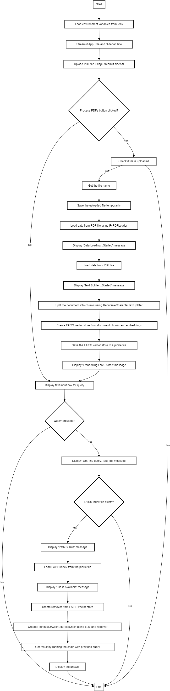

# Bot: Research Tool 📈

This is a research tool that allows users to upload PDF documents, process them, and ask questions about the content. It uses OpenAI's embeddings and FAISS for efficient similarity searches and document retrieval.


## Project-Flow

<div align="center">

</div>
 
## Introduction

This project is a research tool designed to help users upload PDF documents, process them, and retrieve information by asking questions about the content. The tool leverages OpenAI's embeddings and FAISS (Facebook AI Similarity Search) to perform efficient similarity searches and document retrieval. By using this tool, users can interact with their documents in a more dynamic and insightful manner.

## Features

- Upload and process PDF documents.
- Split documents into manageable chunks.
- Generate and store embeddings using OpenAI's API.
- Retrieve answers to questions based on the uploaded documents.

## Installation

To get started with theBot: Research Tool, follow these steps:

1. **Clone the repository:**

   ```bash
   git clone https://github.com/AY-Anish-Yadav/EquiNews-LLM-AI-Powered-News-Research-Tool-for-Equity-Analysts.git
   cd EquiNews-LLM-AI-Powered-News-Research-Tool-for-Equity-Analysts

2. **Install the required dependencies:**

   ```bash
   pip install -r requirements.txt

## Usage

Run the Streamlit app:
   ```bash
   streamlit run app.py
   ```

## Contributing

Contributions are welcome! If you would like to contribute to the project.

## License

This project is licensed under the Apache 2.0 License - see the LICENSE file for details.

## Contact

For any inquiries or feedback, feel free to contact:

Anish Yadav - reach.anish.yadav@gmail.com


  